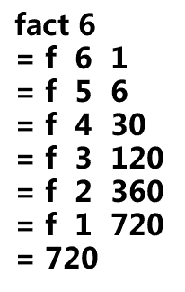

<style>
.dark q {
  color: white;
}

g {
  color: green;
}

r {
  color: red;
}

strong {
  font-weight: bold;
}


</style>


## Outline

* Overview

* Clojure Fundamentals

* Functional Programming in Clojure

* Java Interop

* Marco

* Q & A


--- bg:#CCC
### Alan J. Perlis (Epigrams on Programming)

<q>"A language that doesn't affect the way you think about programming, is not worth knowing. " </q>

---

|Year | Language   |Year | Language                             
|-----|------------|-----|----------                  
|1957 |FORTRAN     |1993 | Ruby
|1958 |LISP        |1993 | Lua
|1959 |COBOL       |1995 | JavaScript
|1964 |BASIC       |1995 | Java
|1970 |Forth       |1995 | PHP
|1972 |C           |2000 | ActionScript
|1972 |Smalltalk   |2001 | C#  
|1983 |C++         |2001 | Visual Basic .NET
|1984 |Common Lisp |2002 | F#
|1986 |Objective-C |2003 | Groovy    
|1986 |Erlang      |2003 | Scala
|1987 |Perl        |2007 | <r>Clojure</r>
|1990 |Haskell     |2009 | Go
|1991 |Python      |2011 | Dart
|1991 |Visual Basic|2012 | Rust


--- .segue .dark

## Overview

---
## Clojure Status

* started in 2007

* Original author: Rich Hickey

* Latest Stable Release: 1.6.0 (April, 2014)

* Open Source under Eclipse Public License

---
## What is Clojure?

* Lisp dialect (Code as data)
* Dynamic 
* Functional (immutability)
* General-purpose 
* Compiled
* Hosted on JVM, also CLR and JavaScript

---
## Why use Clojure

> * More fun & less code
> * Focus on problem
> * Supporting concurrency by default
> * Interactive programming
> * Robust, practical & high-performance
> * Java ecosystem

---
## Development environment

* REPL

* Light Table (newbie)

* Eclipse with Counterclockwise

* Intellij IDEA with La Clojure

* Emacs with emacs-live (recommend)

--- .segue .dark

## Clojure Fundamentals

---
## S-Expressions
A Clojure form, and parameter can also be a form.

```clojure
(symbol parameter1 parameter2 ...)
```

```clojure
(+ 1 2) ;=> 3
(* 1 3) ;=> 3
(- 3 2) ;=> 1 
(/ 8 2) ;=> 4

(+ 1 2 3) ;=> 6

(+ 1 (+ 2 3) (- 3 2)) ;=> 7

(println "hello!") 
;hello!
;=> nil

```

---
## Actomic Data Types

* Boolean:  <g> true false </g>

* Number:  <g> 1234567890876544321, 1e65, 2r1010, 1.23, 25/7 </g>

* String:  <g> "hello" </g>

* Character:  <g> \c \b \a \space \newline \tab </g>

* Null:  <g> nil </g>

* Symbol:  <g> def read zero? +  </g>

* Keyword:  <g> :mykey :ethel :tainan </g>

* Regex pattern:  <g> #"...pattern..." </g>

---
## Some Code

```clojure
(/ 3 5) ;=> 3/5
(* 5 (/ 3 5)) ;=> 3N

(not true) ;=> false
(= "aa" (str "a" "a") ) ;=> true
(= 1 1) ;=> true

(str "hello" "-" "world" "!") ;=> hello-world!

(identical? "aa" (str "a" "a")) ;=> false
(nil? nil) ;=> true 

(class "hello") ;=> java.lang.String
(class 1) ;=> java.lang.Long
```

--- bg:#CCC
### Alan J. Perlis (Epigrams on Programming)

<q>"It is better to have 100 functions operate on one data structure than to have 10 functions operate on 10 data structures." </q>

---
## Clojure Data Structures

* List: <g> (1 2 3 4 5), ("abc" "bac" "aaa"), (list 1 2 3) </g>

* Vector: <g> [1 2 3 4 5], [Mon Tue Wen Thu] </g>

* Map: <g> {:a 1, :b 2, :c 3}, {1 "one" 2 "two"} </g>

* Set: <g> #{"foo" "bar" "baz"} </g>

---
## Some Code 

```clojure
(class [1 2 3]) ;=> clojure.lang.PersistentVector
(class '(1 2 3)) ;=> clojure.lang.PersistentList
(class #{1 2 3}) ;=> clojure.lang.PersistentHashSet
(class {:k1 1 :k2 2}) ;=> clojure.lang.PersistentArrayMap

(str 2 3) ;=> 23
'(str 2 3) ;=> (str 2 3)
(eval '(str 2 3)) ;=>23

(coll? [1 2 3]) ;=> true
(coll? '(1 2 3)) ;=> true
(coll? #{1 2 3}) ;=> true
(coll? {1 2 3 4}) ;=> true

;;Seqs are an interface for logical lists, which can be lazy.
(seq? [1 2 3]) ;=> false
(seq? '(1 2 3)) ;=> true
(seq? #{1 2 3}) ;=> false
(seq? {1 2 3 4}) ;=> false
```

---
## Some Code (cont.)

```clojure
(range 5) ;=> (0 1 2 3 4)
(range) ;=> (0 1 2 3 4 5 ...∞) ;lazy
(take 5 (range)) ;=> (0 1 2 3 4)
(nth (range) 3) ;=> 3

;;Use cons to add an item to the beginning of a list or vector
(cons 4 [1 2 3]) ; => (4 1 2 3)
(cons 4 '(1 2 3)) ; => (4 1 2 3)
;;Add to the beginning of a list, or the end of a vector
(conj [1 2 3] 4) ; => [1 2 3 4]
(conj '(1 2 3) 4) ; => (4 1 2 3)

(concat [1 2] '(3 4)) ;=> (1 2 3 4)

(first '(1 2 3)) ;=> 1
(rest '(1 2 3))  ;=> (2 3)
(rest ()) ;=> ()
(empty? ()) ;=> true
```

---
## Some Code (cont.)

```clojure
(apply + [1 2 3 4]) ;=> 10  ;;(+ 1 2 3 4)

(count [0 1 2 3]) ;=> 4

(def mymap {:g "Google" :a "Apple" :h "htc" :s "Samsung"}) ;=> #'user/mymap

(count mymap) ;=> 4

(mymap :a) ;=> "Apple"
(:g mymap) ;=> "Google"

(= mymap (hash-map :g "Google" :a "Apple" :h "htc" :s "Samsung")) ;=> true

(assoc mymap "o" "Oracle") ;=> {:g "Google" :a "Apple" :o "Oracle :h "htc" :s "Samsung"}
(dissoc mymap :s :h :a) ;=> {:g "Google"}

mymap ;=> {:g "Google" :a "Apple" :h "htc" :s "Samsung"}  ;; immutable
```

---
## Functions

```clojure
;; Anonymous
(fn [x y] (* x y))
(fn [& xs] (coll? xs))
(fn sum [x] (+ x (sum dec (x))))
(sum 10) ;;=> Unable to resolve symbol: sum ...

;;In-place function
#(str %1 %2 %3) ;; arguments => %1 %2 ... %n
```

```clojure
(def square (fn [x] (* x x)))
(def square #(* % %))
(square 10) ;=> 100
```

```clojure
;; defn => def + fn
(defn sum 
    [a b c & others] 
    (+ a b c (apply + others)))
(sum 1 2 3 4 5 6 7) ;=> 28
```

---
## Hello World function

```clojure 
(defn hello
  "Say hello world!"
  [] (println "Hello World!"))

```
```clojure
(hello)
;Hello World!
;=> nil
```

---
## Hello World function with parameter

```clojure
(defn hello
  "Say hello to someone!"
  ([] (println "Hello World"))
  ([someone] (println "Hello" someone)))

```
```clojure
(hello)
;Hello World!
;=> nil

(hello "Sam")
;Hello Sam
;=> nil
```


--- .segue .dark
## Functional programming in Clojure

---
## What is Functional programming  

<q>
**Functional programming** is a style of building the structure and elements of computer programs, that treats computation as the evaluation of mathematical functions and avoids state and mutable data. </q>

---
## Functional Progamming Features

* First-class functions

* Immutability

* Pure functions (no side effect)

* Recursion

* Expression

* Compose functions

* Lazy evaluation

---
## First-class & Higher-order function

### First-class means the language supports 

1. passing functions as arguments
2. returning functions as the values
3. assigning them to variables or storing them in data structures


### Higher-Order Functions is a function that does at least one of the following:

1. takes one or more functions as an input
2. outputs a function

---
## First-class & Higher-order function (Cont.)
### Passing functions as arguments
```clojure 
(def square (fn [x] (* x x))) ;=> #'user/square

(def add2 (fn [x] (+ 2 x))) ;=> #'user/add2

(defn sum-by [x f] 
  (apply + (map f x))) ;=> #'user/sum-by

(sum-by [1 2 3] square) ;=> 14

(sum-by [1 2 3] add2) ;=> 12
```

---
## First-class & Higher-order function (Cont.)

### Returning function as value
```clojure 
(defn power [base]
  "Return a power function based on passing argument"
  (let [b base]
    (fn [exp] (Math/pow  b exp))))
    
(def base2 (power 2))

(def base5 (power 5))


(base2 10) ;=> 1024

(base5 2) ;=> 25
```

---
## Closure
#### Any first class function with **free variables** is a closure.

```clojure 
(defn time-n [n]
  (fn [y] (* n y)))

(def time3 (time-n 3))

(time3 10) ;=> 30
```

```clojure
(defn grant [uid gid]
  (let [u uid g gid]
    (fn [method] (check u g method))))

(def check-permission (grant 0 1))

(check-permission "api/delete")

```

--- &twocol w1:40% w2:60%
## Recursion 

A recursive factorial sample


*** =left


*** =right

```Clojure 
(defn factorial [n]
  (if (= 1 n)
    1
    (* n (factorial (dec n)))))
```

```clojure 
(factorial 6) ;=> 720

(factorial 10000N) ;=> StackOverFlowError
```

--- &twocol w1:40% w2:60%
## Tail-recursion
> * JVM does not support tail-call optimization,so StackOverFlowError still exists.

*** =left


*** =right
```clojure
(defn fact [n]
  (letfn [(f [i a]
            (if (<= i 1)
              a
              (f (dec i) (* i a))))]
    (f n 1)))    

```

---
## Tail-recursion with **recur**

**recur** is the only non-stack-consuming looping construct in Clojure.

```clojure
(defn fact [n]
  (loop [i n a 1]
    (if (<= i 1) 
      a 
      (recur (dec i) (* i a)))))
```

```clojure 
(fact 6) ;=> 720

(fact 10000N) ;=> ...
```

BTW... more concise way

```clojure
(defn fact [n]
  (apply * (range 1 (inc n))))

```

---
## Partial functions & Compose functions

```clojure
(def add5 (partial + 5)) ;=> #'user/add5

(add5 5) ;=> 10
 
((partial + 5) 5) ;=> 10
```
BTW ... **Curry** is a chain of partial functions each with a single argument

```clojure
(def not-zero? (comp not zero?)) 

(not-zero? 1) ;=> true
(not-zero? 0) ;=> false

((comp second reverse) '("a" 2 3 "b")) ;=> 3
```

--- &twocol w1:40% w2:60%
## Map, Reduce and Filter
*** =left
### Map


### Filter


*** =right
### Reduce
![] (assets/img/reduce.png)

---
## Map, Reduce and Filter

```Clojure
(def data '(1 2 3 4 5))

(defn square [x] (* x x))

(map square data) ;=> (1 4 9 16 25)
(map #(* % %) data) ;=> (1 4 9 16 25)

(filter odd? data) ;=> (1 3 5)
(filter #(> % 5) data) ;=> ()
(filter (partial < 3) data) ;=> (4 5)

(reduce * data) ;=> 120
(reduce str data) ;=> "12345"
(reduce #(str %2 %1) data) ;=> "54321"

(take 5 (filter odd? (range))) ;=> (1 3 5 7 9)
(take 5 (map #(+ % %) (range))) ;=> (0 2 4 6 8)

(reduce + (range)) ;=> non-stop ..
```

---
## Lazy evaluation

* Sequences can be lazy...

```clojure
(cycle [1 2 3]) ;=> (1 2 3 1 2 3 ...)
(repeat "a") ;=> ("a" "a" "a" ...)
(range) ;=> (0 1 2 3 4 ...)
(class (range)) ;=> clojure.lang.LazySeq

(take 5 (repeat 1)) ;=> (1 1 1 1 1)

```
```clojure
(defn n-repeat [n] 
  (lazy-cat 
    (repeat n n) (n-repeat (inc n))))

(n-repeat 1) ;=> (1 2 2 3 3 3 4 4 4 4 5 5 5 5 5 ...)

```

---
## Fibonacci Series Example

### Simple recursive version

```clojure
(defn fib1 [n]
  (if (< n 2)
    n
    (+ (fib1 (- n 2)) (fib1 (- n 1)))))
```
```clojure
(fib 7) ;=> 13

(take 10 (map fib1 (range))) 
;=> (0 1 1 2 3 5 8 13 21 34)

```

> * Very slow

---
## Fibonacci Series Example (Cont.)

### Memoized recursive version

```clojure
(defn fib2 [n]
  (if (< n 2)
    n
    (+' (mfib (- n 2)) (mfib (- n 1)))))

(def mfib (memoize fib2))
```
```clojure
(mfib 1000) ;=> StackOverflowError

(take 10000 (map mfib (range))) ;=> (0 1 1 ...)
```

> * Speed up but StackOverflowError

---
## Fibonacci Series Example (Cont.)

### Tail recursion version
```clojure
(defn fib3 [n]
  (loop [i n p 0 acc 1]
    (if (zero? i)
      p
      (recur (dec i) acc (+' acc p)))))
```

```clojure
(map fib3 (range  10)) ;=> (0 1 1 2 3 5 8 13 21 34)

(count (str (fib3 100000))) ;=> 20899

```

---
## Fibonacci Series Example (Cont.)

### Lazy version -1
```clojure
(def fib4
  ((fn f [p c]
     (cons p (lazy-seq (f c (+' p c)))))
   0 1))
```

```clojure
fib4  ;=> (0 1 1 2 3 5 8 ...)

(count (str (nth fib4 100000))) ;=> 20899

```

---
## Fibonacci Series Example (Cont.)

### Lazy version -2

```clojure
(def fib5 (lazy-cat [0 1] (map +' fib5 (rest fib5))))
```

```clojure
fib5  ;=> (0 1 1 2 3 5 8 ...)

(take 10 fib5) ;=> (0 1 1 2 3 5 8 13 21 34)
```

---
## Clojure in JVM

* Clojure strings are Java **Strings**.

* Clojure **nil** is Java’s **null**.

* Clojure numbers are Java numbers.

* Clojure regular expressions are instances of **java.util.regex.Pattern**.

* Clojure data structures 
  - Clojure maps implement **java.util.Map**
  - Clojure vectors and sequences and lists implement **java.util.List**
  - Clojure sets implement **java.util.Set**

* Clojure functions implement **java.lang.Runnable** and **java.util.concurrent.Callable**


---
## Java Interop

```Clojure
(.toUpperCase "abc") ;=> ABC

;; static method
(Integer/parseInt "10") ;=> 10

;; new Object
(java.io.File. "~/test.txt") ;=> #<File ~/test.txt>

(instance? String "foo")  ;=> true
```

```Clojure
(import java.util.ArrayList)
(def foo (ArrayList. [1 2 3 4]))

(reduce + foo) ;=> 10

(seq foo) ;=> (1 2 3 4)

(.containsAll foo [2 3 4]) ;=> 4


```

---
## Java Interop (Cont.) 

```Clojure
;;; Modify object's field
(def pt (java.awt.Point. 5 10))  ;=> #'user/pt

(.x pt)  ;=> 5
(set! (.x pt) 10) ;=> 10
(.x pt) ;=> 10
```

```Clojure
;;; Type hints
(defn #^String reverse
  [#^String s]
  (clojure.string/reverse s)) 

(reverse "abcd") ;=> "dcba"

```

--- &twocol w1:40% w2:60%
## Macro

*** =left


*** =right

* Lisp is a **programmable** programming languages.

* **Homoiconicity**
  - Code written in the language is encoded as data structures.
  
* Extends your code in **compile time**.

---
## Macro 

A simple macro example..

```clojure
(defmacro postfix
  [expr]
  (conj (butlast expr) (last expr)))

(macroexpand-1 '(postfix (1 1 +))) ; => (+ 1 1)

(postfix (1 2 3 +)) ;=> 6
```

---
## Macro 

A funny example ...
```clojure
(require '(clojure [string :as str]
                   [walk :as walk]))
(defmacro reverse-it 
  [form]
  (walk/postwalk #(if (symbol? %)
                   (symbol (str/reverse (name %)))
                    %)
                 form))
```
```clojure
(reverse-it
 (qesod [gra (egnar 3)]
        (nltnirp "hello "(cni gra)))) 
        
;hello 1
;hello 2
;hello 3
;=> nil

```


---
## Useful Built-in Macro
#### (-> x form & more)

```Clojure
(def c 5)
;; infix: ((c + 3) / 2 - 1)
(- (/ (+ c 3) 2) 1) ;=> 3

(-> c (+ 3) (/ 2) (- 1)) ;=> 3
```
```clojure
(first (.split (.replace (.toUpperCase "a b c d")
                         "A"
                         "X")
               " ")) ;=> X

(-> "a b c d"
    (.toUpperCase)
    (.replace "A" "X")
    (.split " ")
    (first)) ;=> X
```

---
## Useful Built-in Macro (cont.)

#### (->> x form & more)

```Clojure
(def c 5)
(->> c (+ 3) (/ 2) (- 1)) ;=> 3/4
;; (-1 (/ 2 (+3 c)))
```
```clojure
(reduce +
        (take 10
              (filter even?
                      (map #(* % %)
                           (range)))))  ;=> 1140
                           
(->> (range)
     (map #(* % %))
     (filter even?)
     (take 10)
     (reduce +)) ;=> 1140                          
```

---
## Useful Built-in Macro (cont.)

#### (doto x & forms)

```Clojure
(import javax.swing.JFrame)

(doto (JFrame.)
  (.setTitle "title")
  (.setBackground java.awt.Color/white)
  (.setSize (java.awt.Dimension. 500 500))
  (.setDefaultCloseOperation JFrame/DISPOSE_ON_CLOSE)
  (.setVisible true))
```

```clojure
(doto (java.util.HashMap.)
  (.put "a" 1)
  (.put "b" 2)
  (.put "c" 3)) ;=> #<HashMap {b=2, a=1, c=3}>   

```

--- .segue .dark
## Q & A


--- 
## Some Learning Material

* Online
  - Try Clojure (http://tryclj.com/)
  - Clojure Koans (http://clojurekoans.com/)
  - 4clojure (https://www.4clojure.com/) (good!)
  - ClojureTV on Youtube
  
* Books
  - Clojure Programming (http://www.clojurebook.com/)
  
  - The Joy of Clojure (Not for beginner)
  
* Toolbox 
  - http://www.clojure-toolbox.com/
  
* Cheatsheet
  - http://clojure.org/cheatsheet
